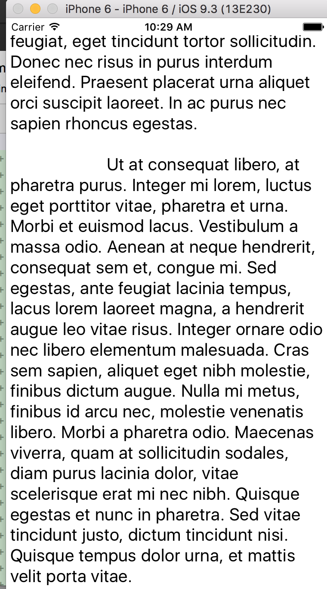

Test using external parallax plugin with nativescript and angular 2

download all code to a local folder

`npm install`

then

`tns run android` or `tns run ios`

you should see someting like this on your emulator or device:
